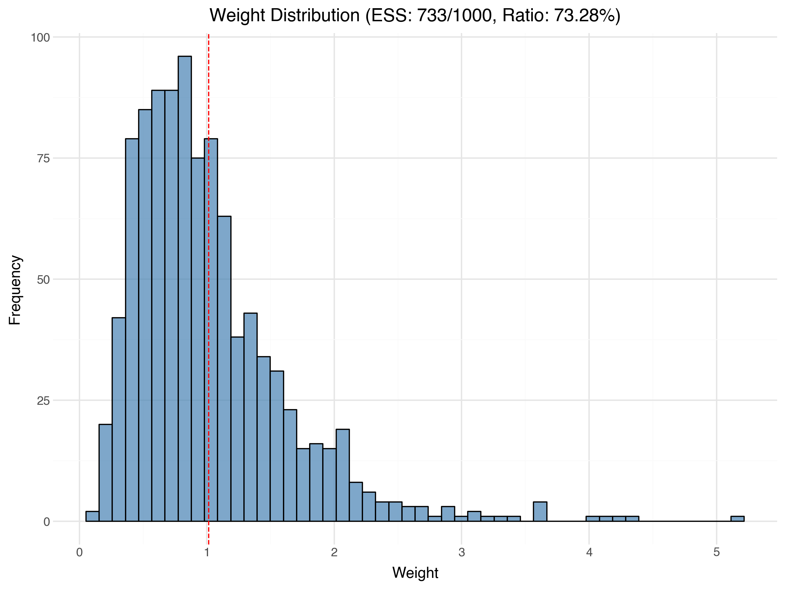
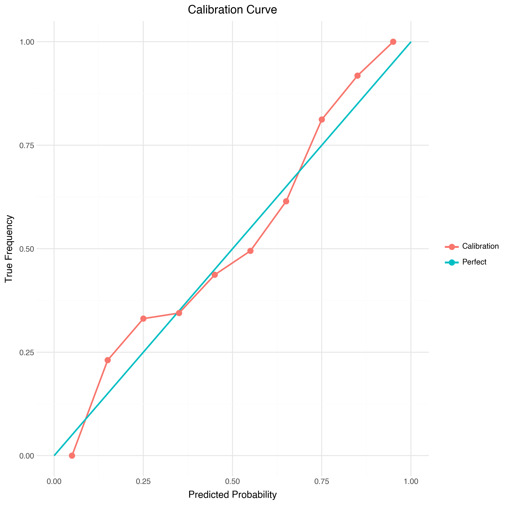
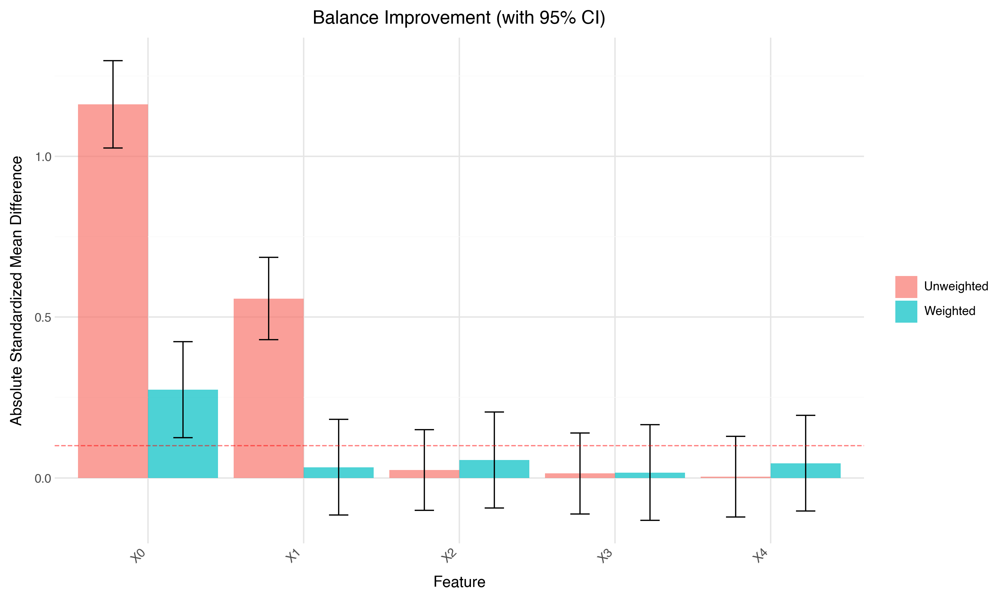
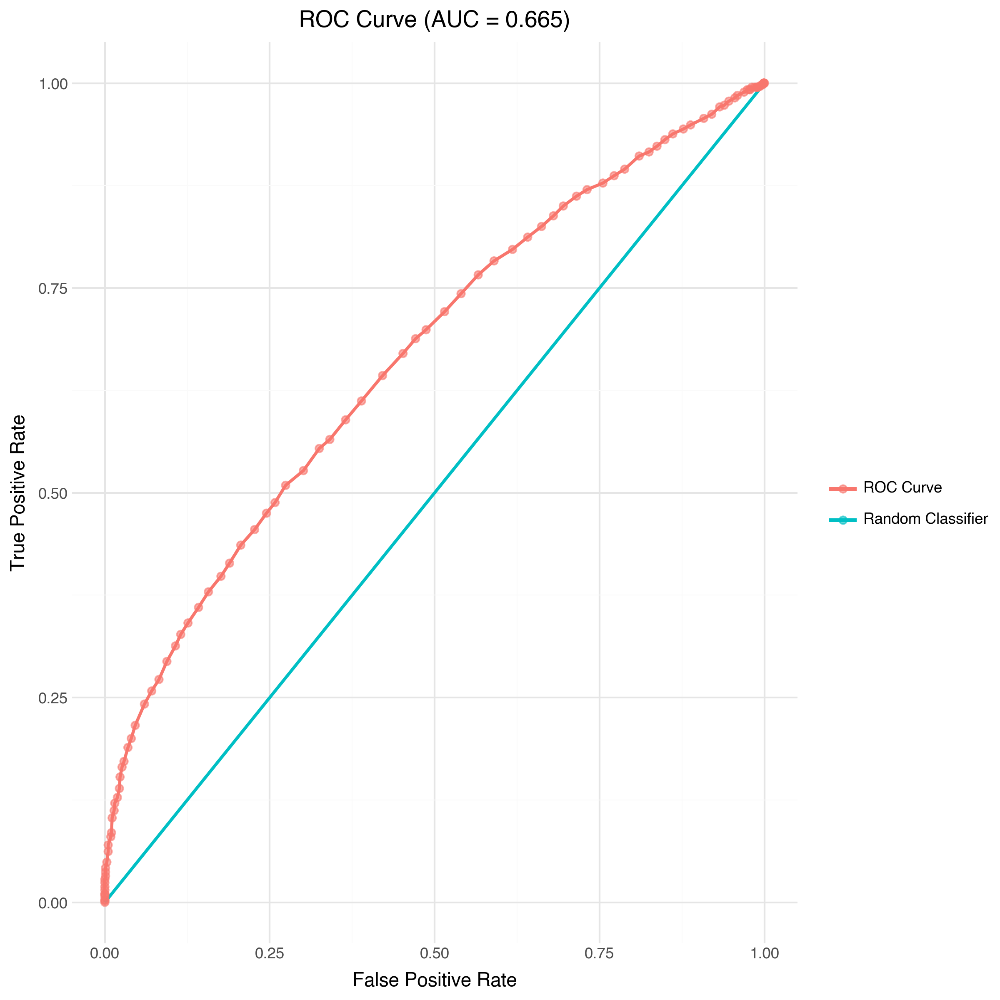

---
jupyter:
  jupytext:
    text_representation:
      extension: .md
      format_name: markdown
      format_version: '1.3'
      jupytext_version: 1.17.3
  kernelspec:
    display_name: Python 3
    language: python
    name: python3
---

# Comprehensive Diagnostics Demo

This example demonstrates comprehensive diagnostics in stochpw:

1. Balance reports
2. Weight statistics
3. ROC curves (most important discriminator diagnostic)
4. Calibration curves
5. Visualization with plotnine

```python
import time

import jax
import jax.numpy as jnp
import optax
from stochpw import (
    PermutationWeighter,
    balance_report,
    calibration_curve,
    roc_curve,
    standardized_mean_difference,
    weight_statistics,
)
from stochpw.plotting import (
    plot_balance_diagnostics,
    plot_calibration_curve,
    plot_roc_curve,
    plot_weight_distribution,
)
```

## Generate Data with Confounding

```python
def generate_confounded_data(n=1000, seed=42):
    """Generate synthetic data with treatment-covariate confounding."""
    key = jax.random.PRNGKey(seed)
    key1, key2, key3 = jax.random.split(key, 3)

    # Generate covariates
    X = jax.random.normal(key1, (n, 5))

    # Treatment depends strongly on first two covariates (confounding)
    propensity = jax.nn.sigmoid(1.5 * X[:, 0] + X[:, 1] - 0.5)
    A = (jax.random.uniform(key2, (n,)) < propensity).astype(float)

    return X, A

start_time = time.time()

print("=" * 70)
print("Comprehensive Diagnostics Demo")
print("=" * 70)

# Generate data
X, A = generate_confounded_data(n=1000, seed=42)
print(f"\nGenerated data: X.shape={X.shape}, A.shape={A.shape}")
print(f"Treatment balance: {jnp.mean(A):.2%} treated")
```

## Step 1: Initial Balance Assessment

```python
print("\n" + "=" * 70)
print("Step 1: Initial Balance Assessment")
print("=" * 70)

uniform_weights = jnp.ones(X.shape[0])
initial_smd = standardized_mean_difference(X, A, uniform_weights)
print(f"\nInitial max SMD: {jnp.max(jnp.abs(initial_smd)):.4f}")
print(f"Initial mean SMD: {jnp.mean(jnp.abs(initial_smd)):.4f}")

# Get full balance report
initial_report = balance_report(X, A, uniform_weights)
print(f"\nTreatment type: {initial_report['treatment_type']}")
print(f"Number of features: {initial_report['n_features']}")
print(f"Number of samples: {initial_report['n_samples']}")
```

## Step 2: Fit Permutation Weighter

```python
print("\n" + "=" * 70)
print("Step 2: Fit Permutation Weighter")
print("=" * 70)

opt = optax.rmsprop(learning_rate=0.1)
weighter = PermutationWeighter(
    num_epochs=50,
    batch_size=250,
    random_state=42,
    optimizer=opt
)

weighter.fit(X, A)
weights = weighter.predict(X, A)

assert weighter.history_ is not None
print(f"\nTraining completed in {len(weighter.history_['loss'])} epochs")
print(f"Final training loss: {weighter.history_['loss'][-1]:.4f}")
```

## Step 3: Balance After Weighting

```python
print("\n" + "=" * 70)
print("Step 3: Balance After Weighting")
print("=" * 70)

final_smd = standardized_mean_difference(X, A, weights)
print(f"\nFinal max SMD: {jnp.max(jnp.abs(final_smd)):.4f}")
print(f"Final mean SMD: {jnp.mean(jnp.abs(final_smd)):.4f}")
smd_improvement = (1 - jnp.max(jnp.abs(final_smd)) / jnp.max(jnp.abs(initial_smd))) * 100
print(f"SMD improvement: {smd_improvement:.1f}%")

# Get comprehensive balance report
final_report = balance_report(X, A, weights)

print(f"\nEffective Sample Size: {final_report['ess']:.0f} / {final_report['n_samples']}")
print(f"ESS Ratio: {final_report['ess_ratio']:.2%}")
```

## Step 4: Weight Distribution Analysis

```python
print("\n" + "=" * 70)
print("Step 4: Weight Distribution Analysis")
print("=" * 70)

w_stats = weight_statistics(weights)

print("\nWeight Statistics:")
print(f"  Mean: {w_stats['mean']:.3f}")
print(f"  Std: {w_stats['std']:.3f}")
print(f"  Min: {w_stats['min']:.3f}")
print(f"  Max: {w_stats['max']:.3f}")
print(f"  CV (std/mean): {w_stats['cv']:.3f}")
print(f"  Max/Min ratio: {w_stats['max_ratio']:.1f}")
print(f"  Entropy: {w_stats['entropy']:.3f}")
print(f"  N extreme (>10x mean): {w_stats['n_extreme']}")
```

## Step 5: ROC Curve Analysis

ROC curve is the most important discriminator diagnostic.

```python
print("\n" + "=" * 70)
print("Step 5: ROC Curve Analysis")
print("=" * 70)

# Create permuted data for ROC analysis
key = jax.random.PRNGKey(123)
A_perm = A[jax.random.permutation(key, len(A))]

# Get weights for both observed and permuted data
weights_obs = weights
weights_perm = weighter.predict(X, A_perm)

# Combine weights and create labels (0=observed, 1=permuted)
all_weights = jnp.concatenate([weights_obs, weights_perm])
all_labels = jnp.concatenate([jnp.zeros(len(weights_obs)), jnp.ones(len(weights_perm))])

# Compute ROC curve
fpr, tpr, thresholds = roc_curve(all_weights, all_labels)
# Compute AUC using trapezoidal rule
auc = float(jnp.trapezoid(tpr, fpr))

print(f"\nROC AUC: {auc:.4f}")
print(
    "\nInterpretation: AUC measures discriminator's ability to distinguish "
    "observed from permuted."
)
print("  AUC = 0.5: Random guessing (poor discriminator)")
print("  AUC = 1.0: Perfect discrimination")
print(f"  Current AUC = {auc:.4f}: ", end="")
if auc > 0.9:
    print("Excellent discriminator quality")
elif auc > 0.8:
    print("Good discriminator quality")
elif auc > 0.7:
    print("Moderate discriminator quality")
else:
    print("Poor discriminator quality - consider more epochs or larger model")
```

## Step 6: Discriminator Calibration

```python
print("\n" + "=" * 70)
print("Step 6: Discriminator Calibration")
print("=" * 70)

# Generate discriminator predictions on training data
assert weighter.params_ is not None
AX = jnp.einsum("bi,bj->bij", A[:, None] if A.ndim == 1 else A, X).reshape(X.shape[0], -1)
logits = weighter.discriminator.apply(weighter.params_, A[:, None] if A.ndim == 1 else A, X, AX)
probs = jax.nn.sigmoid(logits)

# Use same permuted data from ROC analysis
A_perm_reshaped = A_perm[:, None] if A_perm.ndim == 1 else A_perm
AX_perm = jnp.einsum("bi,bj->bij", A_perm_reshaped, X).reshape(X.shape[0], -1)
logits_perm = weighter.discriminator.apply(weighter.params_, A_perm_reshaped, X, AX_perm)
probs_perm = jax.nn.sigmoid(logits_perm)

# Combine for calibration analysis
all_probs = jnp.concatenate([probs, probs_perm])
cal_labels = jnp.concatenate([jnp.zeros(len(probs)), jnp.ones(len(probs_perm))])

bin_centers, true_freqs, counts = calibration_curve(all_probs, cal_labels, num_bins=10)

print("\nCalibration Analysis (10 bins):")
print(f"{'Predicted':<12} {'Observed':<12} {'Count':<10} {'Error':<10}")
print("-" * 44)
for pred, obs, count in zip(bin_centers, true_freqs, counts):
    if count > 0:
        error = abs(pred - obs)
        print(f"{pred:>10.3f}   {obs:>10.3f}   {int(count):>8}   {error:>8.3f}")
```

## Step 7: Before/After Comparison

```python
print("\n" + "=" * 70)
print("Step 7: Before/After Comparison")
print("=" * 70)

print(f"\n{'Metric':<30} {'Before':<15} {'After':<15} {'Improvement':<15}")
print("-" * 75)
max_smd_imp = (1 - final_report["max_smd"] / initial_report["max_smd"]) * 100
mean_smd_imp = (1 - final_report["mean_smd"] / initial_report["mean_smd"]) * 100
ess_change = (final_report["ess"] / initial_report["ess"] - 1) * 100
print(
    f"{'Max SMD':<30} {initial_report['max_smd']:>13.4f}  "
    f"{final_report['max_smd']:>13.4f}  {max_smd_imp:>12.1f}%"
)
print(
    f"{'Mean SMD':<30} {initial_report['mean_smd']:>13.4f}  "
    f"{final_report['mean_smd']:>13.4f}  {mean_smd_imp:>12.1f}%"
)
print(
    f"{'ESS':<30} {initial_report['ess']:>13.0f}  "
    f"{final_report['ess']:>13.0f}  {ess_change:>12.1f}%"
)
print(
    f"{'ESS Ratio':<30} {initial_report['ess_ratio']:>13.2%}  "
    f"{final_report['ess_ratio']:>13.2%}  {'-':>15}"
)
```

## Step 8: Create Visualizations

```python
print("\n" + "=" * 70)
print("Step 8: Creating Visualizations")
print("=" * 70)

# Plot ROC curve (most important!)
plot_roc = plot_roc_curve(fpr, tpr, auc)
plot_roc.save("roc_curve.png", dpi=150, width=8, height=8)
print("\n✓ Saved: roc_curve.png (MOST IMPORTANT DIAGNOSTIC)")

# Plot balance diagnostics with standard errors
plot_balance = plot_balance_diagnostics(
    X, A, weights, feature_names=[f"X{i}" for i in range(X.shape[1])]
)
plot_balance.save("balance_diagnostics.png", dpi=150, width=10, height=6)
print("✓ Saved: balance_diagnostics.png (with 95% confidence intervals)")

# Plot weight distribution
plot_weights = plot_weight_distribution(weights)
plot_weights.save("weight_distribution.png", dpi=150, width=8, height=6)
print("✓ Saved: weight_distribution.png")

# Plot calibration
plot_cal = plot_calibration_curve(bin_centers, true_freqs, counts)
plot_cal.save("calibration_curve.png", dpi=150, width=8, height=8)
print("✓ Saved: calibration_curve.png")

print("\nVisualization files saved to current directory")

print("\n" + "=" * 70)
print("Demo Complete!")
elapsed_time = time.time() - start_time
print(f"Total execution time: {elapsed_time:.2f} seconds")
print("=" * 70)
```

## Output

```
======================================================================
Comprehensive Diagnostics Demo
======================================================================

Generated data: X.shape=(1000, 5), A.shape=(1000,)
Treatment balance: 42.00% treated

======================================================================
Step 1: Initial Balance Assessment
======================================================================

Initial max SMD: 1.1620
Initial mean SMD: 0.3523

Treatment type: binary
Number of features: 5
Number of samples: 1000

======================================================================
Step 2: Fit Permutation Weighter
======================================================================

Training completed in 50 epochs
Final training loss: 0.6504

======================================================================
Step 3: Balance After Weighting
======================================================================

Final max SMD: 0.2745
Final mean SMD: 0.0849
SMD improvement: 76.4%

Effective Sample Size: 733 / 1000
ESS Ratio: 73.28%

======================================================================
Step 4: Weight Distribution Analysis
======================================================================

Weight Statistics:
  Mean: 1.015
  Std: 0.613
  Min: 0.095
  Max: 5.158
  CV (std/mean): 0.604
  Max/Min ratio: 54.3
  Entropy: 6.750
  N extreme (>10x mean): 0

======================================================================
Step 5: ROC Curve Analysis
======================================================================

ROC AUC: 0.6652

Interpretation: AUC measures discriminator's ability to distinguish observed from permuted.
  AUC = 0.5: Random guessing (poor discriminator)
  AUC = 1.0: Perfect discrimination
  Current AUC = 0.6652: Poor discriminator quality - consider more epochs or larger model

======================================================================
Step 6: Discriminator Calibration
======================================================================

Calibration Analysis (10 bins):
Predicted    Observed     Count      Error     
--------------------------------------------
     0.050        0.000          1      0.050
     0.150        0.231         26      0.081
     0.250        0.331        148      0.081
     0.350        0.344        299      0.006
     0.450        0.437        492      0.013
     0.550        0.495        477      0.055
     0.650        0.614        345      0.036
     0.750        0.812        149      0.062
     0.850        0.918         61      0.068
     0.950        1.000          2      0.050

======================================================================
Step 7: Before/After Comparison
======================================================================

Metric                         Before          After           Improvement    
---------------------------------------------------------------------------
Max SMD                               1.1620         0.2745          76.4%
Mean SMD                              0.3523         0.0849          75.9%
ESS                                     1000            733         -26.7%
ESS Ratio                            100.00%         73.28%                -

======================================================================
Step 8: Creating Visualizations
======================================================================

✓ Saved: roc_curve.png (MOST IMPORTANT DIAGNOSTIC)
✓ Saved: balance_diagnostics.png (with 95% confidence intervals)
✓ Saved: weight_distribution.png
✓ Saved: calibration_curve.png

Visualization files saved to current directory

======================================================================
Demo Complete!
Total execution time: 12.58 seconds
======================================================================
```

## Visualizations

### Weight Distribution



### Calibration Curve



### Balance Diagnostics



### Roc Curve




---

[View source on GitHub](https://github.com/ddimmery/stochpw/blob/main/examples/diagnostics_demo.py){ .md-button }
